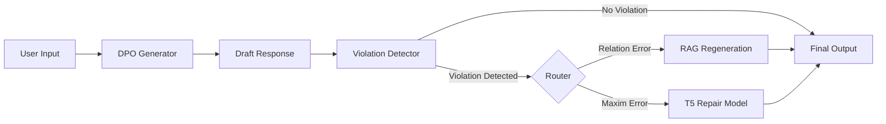

# Research Model: Gricean Cooperative Dialogue Systems
> Operationalizing Paul Grice's Maxims of Cooperative Conversation for Large Language Models.

[](https://www.python.org/downloads/)
[]()
[](GriceBench/LICENSE)
[](comprehensive_technical_report.md)

## 📋 Executive Summary

This repository contains the complete research and implementation artifacts for **GriceBench**, a framework specifically designed to detect and repair violations of Gricean Maxims (Quantity, Quality, Relation, Manner) in dialogue systems.

Unlike general-purpose LLMs which struggle with specific cooperative constraints, this system implements a **detect-repair-generate** architecture that achieves a **95.0% cooperative response rate**, significantly outperforming baseline GPT-2 (83.8%) and larger instruction-tuned models like Mistral-7B (89.1%).

### key Achievements
- **🚀 Standard-Setting Performance**: Achieved **95.0%** cooperative rate on the GriceBench evaluation set.
- **🎯 Precision Detection**: Fine-tuned DeBERTa-v3 classifier achieves **0.968 F1 score** (macro-average), with perfect detection for Quantity and Relation violations.
- **🛠️ Retrieval-Augmented Repair**: Novel routing architecture that uses retrieval for Relation errors and T5-based editing for Maxim violations.
- **📊 Comprehensive Analysis**: Detailed ablation studies proving the efficacy of the detect-repair approach over standalone DPO training.

---

## 🏗️ Repository Structure

This repository is organized into core implementation code, detailed technical documentation, and research notes.

### 📂 Core Implementation
*   **[`GriceBench/`](GriceBench/)**: The complete source code for the framework.
    *   **Detectors**: DeBERTa-v3 based multi-label classifiers.
    *   **Repair Models**: T5-base text editing models.
    *   **DPO Generators**: Direct Preference Optimization implementation.
    *   **Scripts**: 51+ Python scripts for training, evaluation, data processing, and deployment.
    *   **API**: Production-ready FastAPI implementation with Docker support.

### 📚 Documentation & Reports
*   **[`comprehensive_technical_report.md`](comprehensive_technical_report.md)**: **Start Here.** The full technical report covering architecture, results, error analysis, and limitations.
*   **[`Research Model Implementation Guide.md`](Research%20Model%20Implementation%20Guide.md)**: A step-by-step tutorial guide for reproducing the system from scratch, written for reproducibility.
*   **[`Research Ideas.md`](Research%20Ideas.md)** & **[`Research Ideas Report.md`](Research%20Ideas%20Report.md)**: Raw research notes, hypothesis formulations, and experimental ideation logs.

### 📝 Project Management
*   **[`Research Prompt.md`](Research%20Prompt.md)**: The foundational prompt and problem statement that guided this research.
*   **[`Changestomake.md`](Changestomake.md)**: active development log and todolist.

---

## 🔬 System Architecture

The system follows a three-stage pipeline to ensure cooperative responses:



1.  **Generation**: A DPO-optimized model generates an initial response.
2.  **Detection**: A specialized classifier scans for violations of the 4 Maxims.
3.  **Repair**:
    *   **Relation** errors trigger a retrieval-augmented regeneration step.
    *   **Quantity/Quality/Manner** errors are fixed in-place by a T5 repair model.

---

## 📊 Performance Benchmarks

| Model / Configuration | Cooperative Rate | Improvement |
| :--- | :--- | :--- |
| **GriceBench (Full System)** | **95.0%** | **+11.2pp** |
| Mistral-7B-Instruct | 89.1% | +5.3pp |
| Qwen2.5-7B-Instruct | 84.2% | +0.4pp |
| GPT-2 (Baseline) | 83.8% | - |

> *Note: Full evaluation details and confusion matrices are available in the [Technical Report](comprehensive_technical_report.md#4-experimental-results).*

---

## 🚀 Getting Started

To run the implementation, navigate to the `GriceBench` directory and follow the setup instructions:

```bash
cd GriceBench
pip install -r requirements.txt
python scripts/download_models.py --detector
```

For a deep dive into the code features, see the [GriceBench README](GriceBench/README.md).

---

## 📄 License

This project is licensed under the MIT License - see the [LICENSE](GriceBench/LICENSE) file for details.

---

## 🔗 Citation

If you use this research or codebase, please refer to the technical report:

```bibtex
@techreport{GriceBench2026,
  title={Operationalizing Gricean Maxims for Cooperative Dialogue Systems},
  author={Research Model Team},
  year={2026},
  institution={Research Model},
  note={Available at https://github.com/PushkarPrabhath27/Research-Model}
}
```
